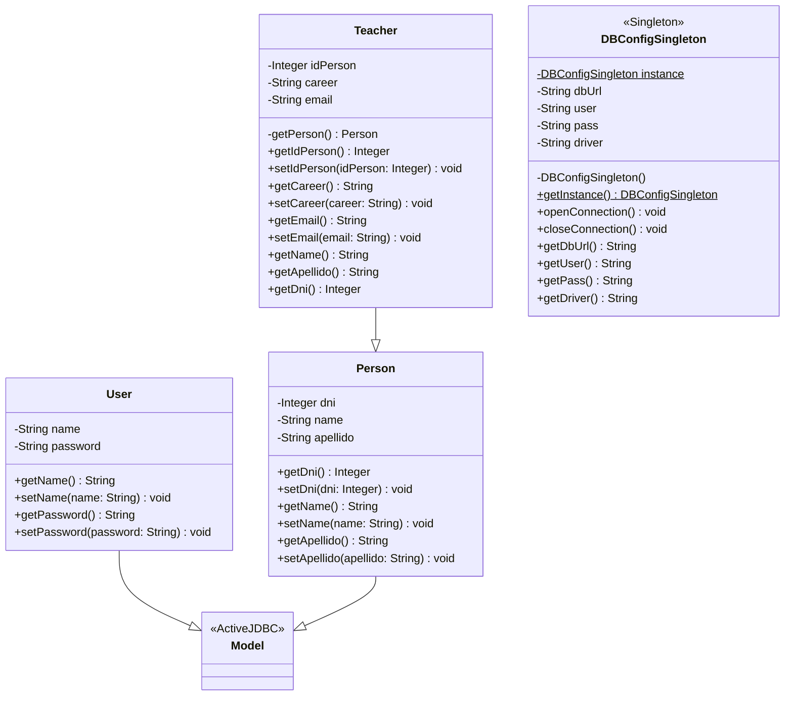

# Diagrama de Clases UML

```mermaid
classDiagram
    %% Definición de la clase base Model (ActiveJDBC)
    class Model {
        <<ActiveJDBC>>
    }

    %% Definición de User
    %% Entidad asociada a la tabla 'users'
    class User {
        -String name
        -String password
        +getName() String
        +setName(name: String) void
        +getPassword() String
        +setPassword(password: String) void
    }

    %% Definición de Person
    %% Entidad asociada a la tabla 'persons'
    class Person {
        -Integer dni
        -String name
        -String apellido
        +getDni() Integer
        +setDni(dni: Integer) void
        +getName() String
        +setName(name: String) void
        +getApellido() String
        +setApellido(apellido: String) void
    }

    %% Definición de Teacher
    %% Entidad asociada a la tabla 'teachers'
    class Teacher {
        -Integer idPerson
        -String career
        -String email
        -getPerson() Person
        +getIdPerson() Integer
        +setIdPerson(idPerson: Integer) void
        +getCareer() String
        +setCareer(career: String) void
        +getEmail() String
        +setEmail(email: String) void
        +getName() String
        +getApellido() String
        +getDni() Integer
    }

    %% Definición de DBConfigSingleton
    %% Clase de utilidad para configuración de base de datos
    class DBConfigSingleton {
        <<Singleton>>
        -DBConfigSingleton instance$
        -String dbUrl
        -String user
        -String pass
        -String driver
        -DBConfigSingleton()
        +getInstance()$ DBConfigSingleton
        +openConnection() void
        +closeConnection() void
        +getDbUrl() String
        +getUser() String
        +getPass() String
        +getDriver() String
    }

    %% Relaciones de Herencia (Modelo de Dominio Conceptual)
    User --|> Model
    Person --|> Model
    Teacher --|> Person
```
