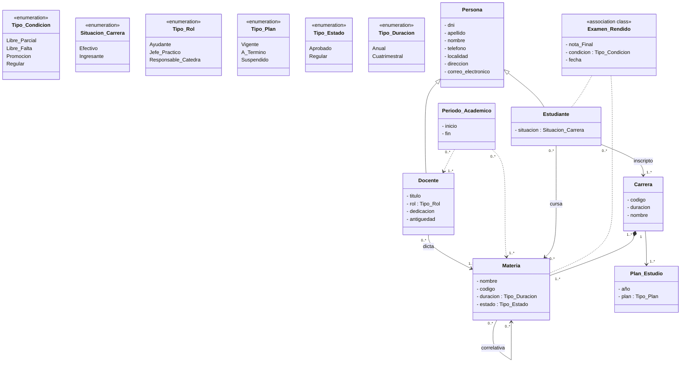

# Diagrama de Clases UML

```mermaid
classDiagram

    %% ─── Enumeraciones ───────────────────────────────────────────────
    class Tipo_Condicion {
        <<enumeration>>
        Libre_Parcial
        Libre_Falta
        Promocion
        Regular
    }

    class Situacion_Carrera {
        <<enumeration>>
        Efectivo
        Ingresante
    }

    class Tipo_Rol {
        <<enumeration>>
        Ayudante
        Jefe_Practico
        Responsable_Catedra
    }

    class Tipo_Plan {
        <<enumeration>>
        Vigente
        A_Termino
        Suspendido
    }

    class Tipo_Estado {
        <<enumeration>>
        Aprobado
        Regular
    }

    class Tipo_Duracion {
        <<enumeration>>
        Anual
        Cuatrimestral
    }

    %% ─── Clases principales ──────────────────────────────────────────
    class Persona {
        - dni
        - apellido
        - nombre
        - telefono
        - localidad
        - direccion
        - correo_electronico
    }

    class Docente {
        - titulo
        - rol : Tipo_Rol
        - dedicacion
        - antiguedad
    }

    class Estudiante {
        - situacion : Situacion_Carrera
    }

    class Periodo_Academico {
        - inicio
        - fin
    }

    class Materia {
        - nombre
        - codigo
        - duracion : Tipo_Duracion
        - estado : Tipo_Estado
    }

    class Carrera {
        - codigo
        - duracion
        - nombre
    }

    class Plan_Estudio {
        - año
        - plan : Tipo_Plan
    }

    class Examen_Rendido {
        <<association class>>
        - nota_Final
        - condicion : Tipo_Condicion
        - fecha
    }

    %% ─── Herencia ────────────────────────────────────────────────────
    Persona <|-- Docente
    Persona <|-- Estudiante

    %% ─── Relaciones ──────────────────────────────────────────────────

    %% Docente dicta Materia
    Docente "0..*" --> "1..*" Materia : dicta

    %% Periodo_Academico vincula Docente y Materia
    Periodo_Academico "0..*" ..> "1..*" Docente
    Periodo_Academico "0..*" ..> "1..*" Materia

    %% Estudiante cursa Materia (Examen_Rendido como clase de asociacion)
    Estudiante "0..*" --> "0..*" Materia : cursa
    Examen_Rendido .. Estudiante
    Examen_Rendido .. Materia

    %% Estudiante inscripto en Carrera
    Estudiante "0..*" --> "1..*" Carrera : inscripto

    %% Materia correlativa con Materia
    Materia "0..*" --> "0..*" Materia : correlativa

    %% Carrera contiene Materia
    Carrera "1..*" *-- "1..*" Materia

    %% Carrera tiene Plan_Estudio
    Carrera "1" --> "1..*" Plan_Estudio
```